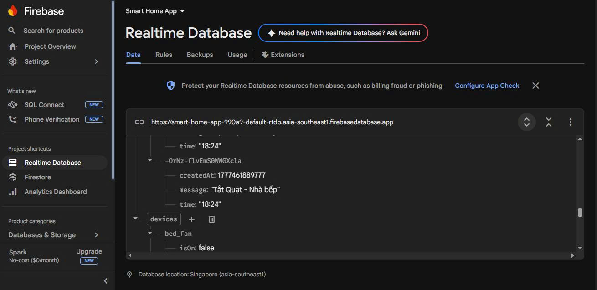

# 🏠 Smart Home App

A Flutter mobile application for managing smart home devices by room, with Firebase Realtime Database integration.

---

## 🚀 Features

- 🔘 Control smart devices such as lights and fans
- 🏠 Manage devices by room: Living Room, Bedroom, Kitchen
- 🔄 Real-time device state synchronization with Firebase Realtime Database
- 📊 Dashboard showing total devices and active devices by room
- 🔍 Search rooms and devices
- 📜 Activity history logging
- ♻️ Reset devices by room or reset all devices
- 🌙 Supports system light/dark mode
- 🔧 Git & GitHub version control

---

## 📱 Screenshots

### Home Dashboard


### Room Device Control


### Activity History


### Firebase Realtime Database


---

## 🛠 Tech Stack

- Flutter
- Dart
- Firebase Realtime Database
- Firebase Core
- Git & GitHub

---

## 📂 Project Structure

```text
lib/
├── main.dart
├── models/
│   └── device_model.dart
├── pages/
│   ├── room_detail_page.dart
│   └── activity_history_page.dart
└── services/
    ├── firebase_realtime_service.dart
    └── fake_api_service.dart