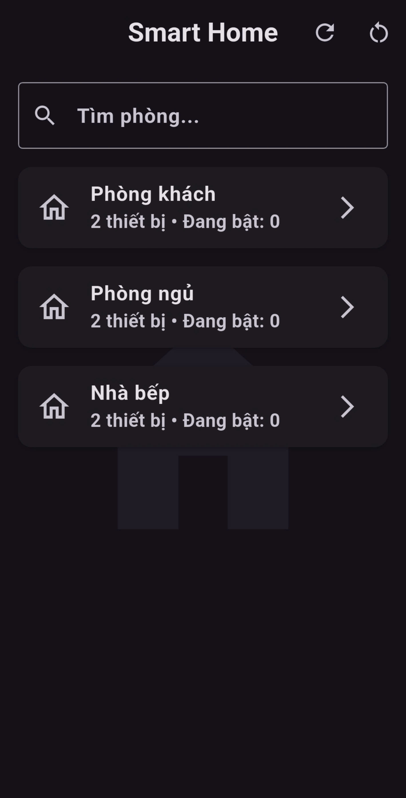
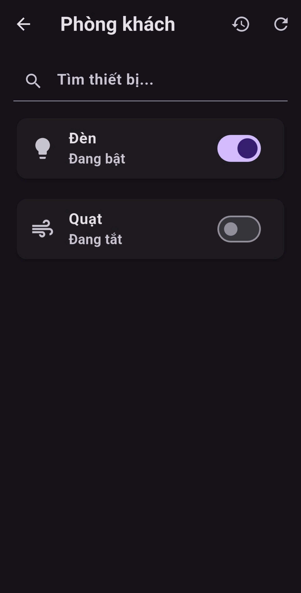
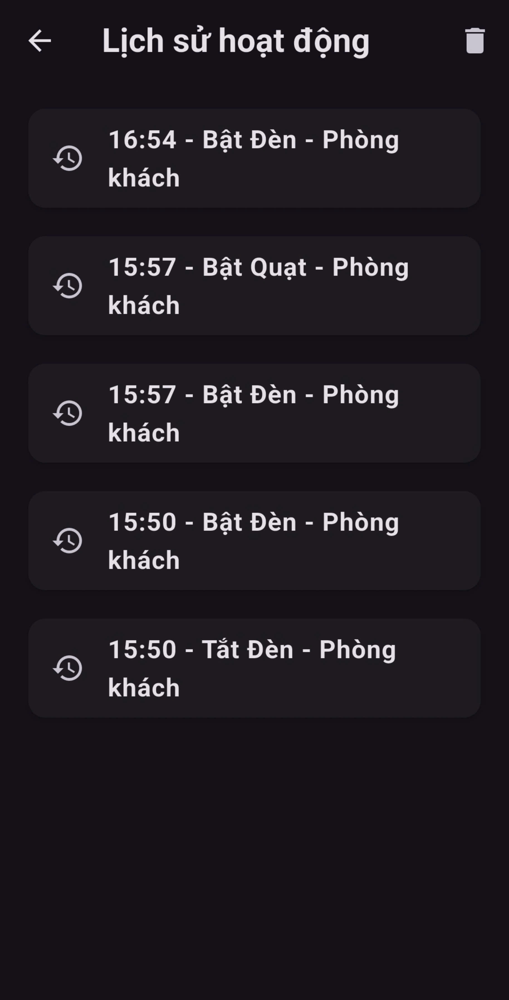

# 🏠 Smart Home App (Flutter)

Ứng dụng quản lý thiết bị nhà thông minh.

---

## 🚀 Features

- 🔘 Bật/tắt thiết bị (Đèn, Quạt)
- 💾 Lưu trạng thái bằng SharedPreferences
- 📊 Dashboard thống kê theo phòng
- 🔍 Tìm kiếm thiết bị & phòng
- 📜 Lịch sử hoạt động
- 🔄 Reset thiết bị theo phòng / toàn bộ

---

## 📱 Screenshots

### Home

### Room

### History

---

## 🛠 Tech Stack

- Flutter
- Dart
- SharedPreferences
- Git & GitHub

---

## 👨‍💻 Author

NguyenQuynhTrang